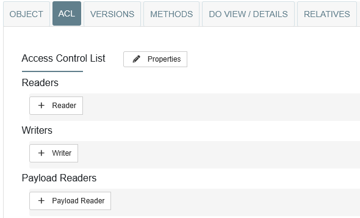

# Managing Access

After creating a data type, it might happen that you want to grant other people from your organization permission to edit the type further. This can be done via the Access Control List (ACL) of the type, which can be accessed via the ACL view when the type is selected.

    <figure markdown="span">
        
        <figcaption>Managing Access Control</figcaption>
    </figure>

By default, the visibility of the type is set to `public`, meaning that all users, also unauthenticated, can see the type. By adding the IDs of users to the `Readers` list, the read access is automatically restricted to these users. Don't forget to add your own ID to this list, or you won't be able to access the type. This might seem unintuitive, but allows users to fully transfer ownership of created types.

    <figure markdown="span">
        
        <figcaption>An example ID that can be added to grant access</figcaption>
    </figure>

By default, only the creator of a type has write access to it. Access for other users can be granted by adding the IDs of users to the `Writers` list. The list of writers follow the same principle as the list of readers, which means allowing users to lose write access to their types by not including themselves in the list of writers.
