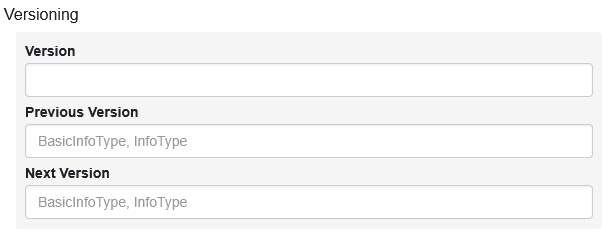
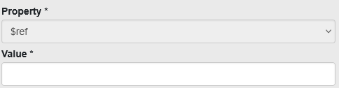
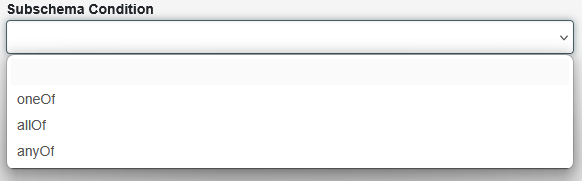
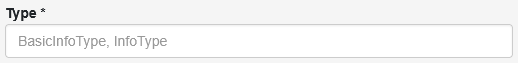
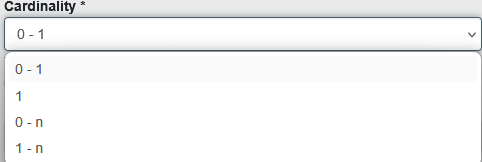
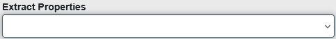
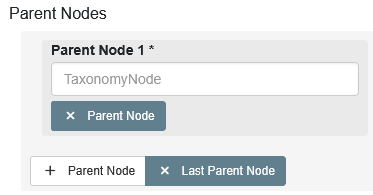

# Type Creation

Here we will walk through the process of creating a new type in the Data Type Registry. This guide focuses on the use of the UI, but the process can also be done via the API. It is helpful though to use the UI first to get an understanding of the structure of types and what is necessary to construct them.

## General

While the different data types serve different purposes, they share some common features. Here we will explain how to create the most common elements of a Data Type, such as descriptive meta.

After name and description, users can versionize their data types. For this, you can enter a `Version`, a `Previous Version` and a `Next Version`. The fields for previous and next version need to be PIDs referencing other `BasicInfoTypes` or `InfoTypes` registered in the DTR. You can use the UI to navigate between versions, or use the TypeAPI for further versioning features. 

<center>
    <figure markdown="span">
        
        <figcaption>Creating versions of a Data Type</figcaption>
    </figure>
</center>

The `Expected Use` field is a short description of how the type should be used. This serves mostly as a reference for the user and especially other users who look for reusable types for their own project.

<center>
    <figure markdown="span">
        
        <figcaption>How the type should be used</figcaption>
    </figure>
</center>

A list of external references can be added to the type. This can be used to link to other types in the DTR, but also to external resources that are not part of the DTR. This is can be helpful for future reference if already existing resources are being registered in the DTR or, for example, an RFC is implemented. 

<center>
    <figure markdown="span">
        
        <figcaption>External References</figcaption>
    </figure>
</center>

`Aliases` can be added to the type. This serves on one hand as information for other users who may know the type under a different name, and simply as tags to find the type more easily using the search features.

<center>
    <figure markdown="span">
        
        <figcaption>Aliases of a Data Type</figcaption>
    </figure>
</center>

Each type can be assigned one or many `TaxonomyNodes`. This can be used to group types together in a way that is more semantically meaningful. The Query Builder can be used to filter results based on the assigned `TaxonomyNodes`, or the TypeAPI can be used to group types hierarchically based on the hierarchical structure of the underlying taxonomy nodes.

<center>
    <figure markdown="span">
        
        <figcaption>Custom Facets for a Type</figcaption>
    </figure>
</center>


## BasicInfoTypes

`BasicInfoTypes` can be considered the basic building blocks, or leaf nodes,  for schema elements. Each `BasicInfoType` is simply
some fundamental data type, with additional metadata and the possibility to apply some restrictions on that type.

As additional metadata field, a `Measurement Unit` can be added to a `BasicInfoType`. This unit should also be registered in the DTR. This has no inherent functionality beyond the ability to use the unit as additional facet, but can prove helpful for future applications, for example conversions between types based on their measurement units. 

<center>
    <figure markdown="span">
        
        <figcaption>Measurement Units for Basic Types</figcaption>
    </figure>
</center>

The fundamental type of a `BasicInfoType` can be selected from the following list. Note here that `Enum` is an additional category. This is because an `enum` can be of mixed values and external references. 

<center>
    <figure markdown="span">
        
        <figcaption>Options for Basic Types</figcaption>
    </figure>
</center>

A `BasicInfoType` can be assigned a set of properties to further restrict the fundamental type it represents. Usually, users want a set of properties to be applied to a type, but there are also some cases where properties need to be chained differently using logical operators. By default, the `AND` operator is used, but this can be changed to `OR` or `XOR` operators. Use cases for different operators are for example allowing different date formats for a type.

<center>
    <figure markdown="span">
        
        <figcaption>How to chain the properties.</figcaption>
    </figure>
</center>

Each property is basically a key - value pair, with the key being the name of the property and the value being the value of the property. Since the main application of schema elements is to generate JSON schemas, the keys follow the [JSON Schema specification](https://json-schema.org/docs/). With the `custom` keyword, addition or special properties can be added. Note that generation of valid schemas with the TypeAPI can not be guaranteed to work if custom properties are used. 

<center>
    <figure markdown="span">
        
        <figcaption>Example for a basic Property.</figcaption>
    </figure>
</center>

One special property is the `$ref` keyword for enums. Even though `$ref` can be in theory used to include anything into a JSON schema, we want to restrict its usage to enum references. This way, large or frequently changing lists of values can be managed outside the DTR and included using a URL. Note that the content behind the URL must be a valid JSON enum. 

<center>
    <figure markdown="span">
        
        <figcaption>Enum Reference.</figcaption>
    </figure>
</center>

## InfoTypes

InfoTypes either combine one or multiple other Types, or represent a collection of multiple instances of the same Type. This includes both other InfoTypes or BasicInfoTypes. Thus, InfoTypes can be of two types: `object` and `array`. Note that `Profiles` have no individual section here, since they share all syntactic properties with `InfoTypes`, but can only take the form of `objects`. 

If the type `object` is selected, subschema conditions can be applied to the resulting schema, which can also be considered boolean schema combinations. Note here a common misconception when using the `allOf` keyword: This does not describe that all of the properties in an `InfoType` must be present, but rather that all of the subschemas must be valid. So, when validating data against the schema, it must validate against each subschema individually.

<center>
    <figure markdown="span">
        
        <figcaption>Subschema Conditions.</figcaption>
    </figure>
</center>

The `name` keyword also serves as the name of the property in the JSON schema.

<center>
    <figure markdown="span">
        
        <figcaption>Name of the property.</figcaption>
    </figure>
</center>

The `Title` and `Description` fields are mostly for use in the resulting JSON schema. If no description is provided, the description for the field in the schema will be extracted from the underlying type, if available. 

<center>
    <figure markdown="span">
        
        <figcaption>Title and description for the JSON Schema.</figcaption>
    </figure>
</center>

A PID reference to another Data Type registered in the DTR must be given in the `type` keyword. 

<center>
    <figure markdown="span">
        
        <figcaption>Type of the property.</figcaption>
    </figure>
</center>

The optional `const` keyword can be used to add a constant value to the property. This should mostly be used if the underlying type is a `BasicInfoType`.

<center>
    <figure markdown="span">
        
        <figcaption>Constant value for the field.</figcaption>
    </figure>
</center>

If the `InfoType` is an object, the `cardinality` keyword can be used to specify the cardinality of the current property. If the property should be used as a simple array without special properties, the cardinality can be used to generate an array in the JSON schema. Note that cardinality `1` and cardinality `1 - n` describe mandatory elements or arrays respectively.

<center>
    <figure markdown="span">
        
        <figcaption>Cardinality for the property.</figcaption>
    </figure>
</center>

The `Extract Properties` keyword is an advanced feature for constructing complex objects. It can only be used if the underlying type of the property is an `InfoType` or a `Profile`, otherwise it has no effect. The keywords effect on a resulting JSON Schema is, that it does not add the referenced type as a property, but rather extracts the properties from the referenced type and adds them individually. This can be a useful tool to expand an existing profile or complex type without needing to reference all individual properties again.

<center>
    <figure markdown="span">
        
        <figcaption>Extraction of Properties.</figcaption>
    </figure>
</center>

As a better explanation consider the following examples of JSON schemas generated from a type. Both types have two properties, a simple  string called `TetstStringSecond` which is a `BasicInfoType`, and and `InfoType` object called `testObject`, which has as its property the same `BasicInfoType` called `testString`. In the first example, we do not extact properties and the object is added as a property to the resulting schema. In the second example, we extract the properties from the `InfoType` and add them as properties to the resulting schema, so both `testString` and `testStringSecond` are on the same level. 

<figure markdown="span">

```json
{
  "$schema": "http://json-schema.org/draft-07/schema#",
  "@id": "21.T11969/cb692fd330999796d709",
  "additionalProperties": false,
  "properties": {
    "testObject": {
      "@id": "21.T11969/94ab75cda0af87cd2172",
      "additionalProperties": false,
      "properties": {
        "testString": {
          "@id": "21.T11969/3df63b7acb0522da685d",
          "type": "string"
        }
      },
      "type": "object"
    },
    "testStringSecond": {
      "@id": "21.T11969/3df63b7acb0522da685d",
      "type": "string"
    }
  },
  "title": "extractProperties",
  "type": "object"
}
```
<center>
    <figcaption>ExtractProperties = false</figcaption>
</center>
</figure>

<figure markdown="span">

```json
{
  "$schema": "http://json-schema.org/draft-07/schema#",
  "@id": "21.T11969/94ab75cda0af87cd2172",
  "additionalProperties": false,
  "properties": {
    "testString": {
      "@id": "21.T11969/3df63b7acb0522da685d",
      "type": "string"
    },
    "testStringSecond": {
      "@id": "21.T11969/3df63b7acb0522da685d",
      "type": "string"
    }
  },
  "title": "Test",
  "type": "object"
}
```
<center>
    <figcaption>ExtractProperties = true</figcaption>
</center>
</figure>

## TaxonomyNodes

`TaxonomyNodes` share all general metadata properties with the other types, but can have a set of `Parent Nodes` assigned to them, which serve as a way to construct simple hierarchies.

<center>
    <figure markdown="span">
        
        <figcaption>Parent Nodes of Taxonomy Node.</figcaption>
    </figure>
</center>