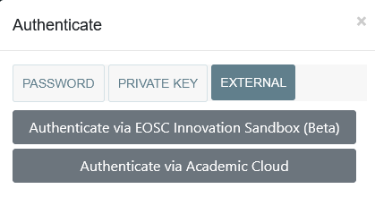

# Navigation and Authentication

This section will provide a quick overview of the navigation and authentication features of the Data Type Registry. 

## Authentication

    <figure markdown="span">
        
        <figcaption>The External authentication options</figcaption>
    </figure>

While exploration of registered types is possible without authentication, the ability to create, update and delete types is restricted to authenticated users. Local accounts can be requested via a mail to support@pidconsortium.net, but users also have the ability to authenticate via an external AAI provider. Authentication is possible via the EOSC Innocation Sandbox, which is currently in beta status, or the Academic Cloud, a service portal for Lower Saxony where account creation is possible for everyone. 

    <figure markdown="span">
        
        <figcaption>A User ID</figcaption>
    </figure>

After authentication, your unique User ID will be displayed on the top navigation. This ID will identify you as creator of types, and can be used in managing access control of types.

## Navigation

High level navigation in the DTR is mostly done via the top navigation bar. In the following section, the different options available to users are described. 

    <figure markdown="span">
        
        <figcaption>The Navigation Bar</figcaption>
    </figure>

* ### Queries
    * #### All Objects
        This displays all types that have been registered in the Data Type Registry, by default sorted by their last modification, so displaying the most recently modified types first. 
    * #### Query Builder
        Although complex queries can be entered in the search bar (refer to the [Cordra documentation](https://www.cordra.org/documentation/api/search.html) for the query syntax), the query builder can be used to construct moderately complex queries, using creator, kind of type, and taxonomy nodes as facets just using the UI.
* ### Show Only
    This option can be used to show all types from a certain kind.
* ### Types
    Here users can view the underlying schemas for the different kinds of types.
* ### Documentation
    Opens this documentation.
* ### Resources
    * #### Type API
        This shows the Swagger UI page for the TypeAPI, which is an additional service that is provided as part of the Data Type Registry component. For a more in-depth description of the TypeAPI, please refer to the [TypeAPI Documentation page](http://typeapi.lab.pidconsortium.net). 
    * #### Cordra DOIP API
        Displays how to use the Digital Object Interface Protocol (DOIP) via HTTP to use the Cordra API.
    * #### Cordra REST API
        Shows how to use the REST endpoints of the Cordra API.
